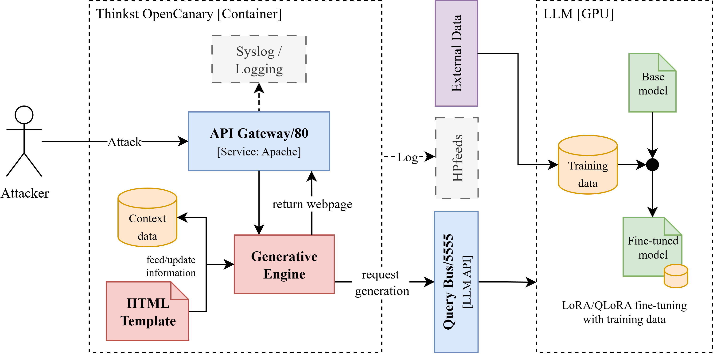

# 🍯🤖 GenPot

<div align="center">
  
  
  <br/>
  <br/>

  <a href="https://python.org"></a>
  <a href="https://huggingface.co/transformers"></a>
  <a href="https://hub.docker.com/r/antoniolara2000/genpot"></a>
  <a href=""></a>
  
</div>

An intelligent honeypot project that integrates fine-tuned language models with OpenCanary and exposes a FastAPI service for deployment and evaluation. This README mirrors the current repository layout and provides the minimal steps to get started (model download, optional fine-tuning, environment/ports configuration, container build, and access via web or API).

⚠️ This project is part of a public research initiative and is intended for educational and experimental purposes only. Ensure compliance with all relevant laws and ethical guidelines when deploying honeypots or AI systems. This includes respecting user privacy, data protection regulations, and avoiding any malicious activities. The authors disclaim any liability for misuse of the software.

ℹ️ This project is part of the publication **_GenPot: A Generative Honeypot Architecture for Adaptive Web and API Interaction_**, by  [](https://orcid.org/0009-0009-0796-4631) [**Antonio Lara-Gutiérrez**](mailto:alara@uma.es), [**Juan Zamorano**](mailto:jzamoraru@uma.es) and [](https://orcid.org/0000-0002-7280-090X) [**José A. Onieva**](mailto:onieva@uma.es).

## Top-level structure (summary)

```
CiberIA_O1_A3/
├── honeypot/
│   └── docs                      # relevant documentation and materials
|       └── Project_structure.png
├── honeypot/
│   ├── docker-compose.yml
│   ├── Dockerfile
│   ├── fastapi/                  # FastAPI server & run scripts
│   │   ├── fastapi_server.py
│   │   └── run.sh
│   ├── fine_tuning/              # scripts, datasets and utils for fine-tuning
│   │   ├── datasets/
│   │   ├── tuning/               # fine tuning scripts
│   │   └── utils/                # download_base_models.py, etc.
│   ├── models/                    # base models and finetuned adapters
│   └── opencanary/                # OpenCanary integration and HTTP skins
├── tests/                         # test scripts and figure generators (E1/E2/E3)
└── README.md
```

## Project architecture and design

An illustrated summary of the system architecture is available under `docs/`. The diagram shows the main components and request flow (OpenCanary -> API Gateway -> Generative Engine -> Query Bus -> LLM -> responses back to the API Gateway)



## Requirements

- Python 3.11+
- Docker and Docker Compose (v2 `docker compose` recommended)
- CUDA-capable GPU if planning to run large models locally (recommended)
- Enough disk space for model weights (several GB)

## Quick start

**1) Download the base models**

  - Use `honeypot/fine_tuning/utils/download_base_models.py` to automate downloads if available.
  - Or place model files manually in `honeypot/models/<model_name>/`.

**2) Fine-tune models (optional)**

  ```bash
  cd honeypot/fine_tuning/tuning
  # Example runs (each script accepts its own options)
  python fine_tuning_gemma.py
  python fine_tuning_llama3.py
  python fine_tuning_zephyr.py
  ```

**3) Configure ports and environment variables**

  - Edit `honeypot/docker-compose.yml` or provide a `.env` with required variables (see `.env.example` with the list of variables used).

**4) Launch the Query Bus API**

  ```bash
  cd honeypot/fastapi
  # Start the FastAPI server
  ./run.sh [port] [GPU]
  ```

**4) Build the Docker image and start services**

  ```bash
  # from repository root
  cd honeypot

  # (optional) remove unused images/containers
  sudo docker system prune -a

  # Build and run (compose)
  sudo docker compose up --build --no-deps --force-recreate
  ```

**5) Access via web or API**

  - Example query to the emulated Synology-like endpoint:

  ```bash
  curl "http://localhost:80/index.html?api=SYNO.Core.System&method=info&version=1"
  ```

  - Or open `http://localhost` in your browser (adjust host/port according to your `docker-compose.yml`).

**9) Pull a public image (optional)**  

[](https://hub.docker.com/r/antoniolara2000/genpot)

You can use the pre-built image from Docker Hub directly instead of building locally:

```bash
sudo docker pull antoniolara2000/genpot:latest
```

## Important files and locations

- `honeypot/docker-compose.yml` — services and port configuration
- `honeypot/Dockerfile` — service image build
- `honeypot/fastapi/fastapi_server.py` — FastAPI server
- `honeypot/fine_tuning/tuning/*.py` — fine-tuning scripts for Gemma, Llama3, Zephyr
- `honeypot/fine_tuning/utils/download_base_models.py` — helper to download models
- `honeypot/opencanary/modules/data/http/skin/nasLogin` — HTTP skin resources (HTML/CSS/images)

## Included experiments (E1, E2, E3)

The repo contains three benchmark/measurement experiments and scripts to generate figures:

- E1 — Latency
  - Plot generator: `honeypot/tests/plot/plot_e1_graphs.py`
  - Results directory: `honeypot/tests/results/latency/` (e.g. `fig1b_latency_boxplot.png`, `fig1c_correctness_radar_combined.png`)
  - Purpose: measure latency and correctness across models and configurations.

- E2 — Load / Throughput
  - Runner: `honeypot/tests/scripts/run_e2_load.py`
  - Results: `honeypot/tests/results/load/` (e.g. `fig2a_rps_vs_p95.png`, `fig2c_concurrency_vs_rps.png`)
  - Purpose: evaluate throughput, errors and scalability (RPS, p95, concurrency effects).

- E3 — Resource profile (CPU / GPU / temperature / time series)
  - Plot generator: `honeypot/tests/plot/plot_e3_graphs.py`
  - Results: `honeypot/tests/results/resources/` (resource time series and comparative plots)
  - Purpose: measure memory/GPU usage, temperatures and resource consumption during runs.

How to regenerate figures:

```bash
# from repo root
python honeypot/tests/plot/plot_e1_graphs.py   # generate E1 plots
python honeypot/tests/plot/plot_e3_graphs.py   # generate E3 plots
# For E2: run the load script and then generate corresponding plots
```

## License

This project is licensed under the MIT License. See [LICENSE](LICENSE) for details.

## Acknowledgements

This repository is part of a publication, which is also part of the project "CiberIA: Investigación e Innovación para la Integración de Ciberseguridad e Inteligencia Artificial (Proyecto C079/23)", financed by "European Union NextGeneration-EU, the Recovery Plan, Transformation and Resilience", through INCIBE. It has also been partially supported by the project SecAI (PID2022-139268OB-I00) funded by the Spanish Ministerio de Ciencia e Innovacion, and Agencia Estatal de Investigacion. Funding for open access charge: Universidad de Málaga / CBUA.

## Citation
<div align="center">
<a href="https://doi.org/10.5281/zenodo.17533746"></a>
</div>